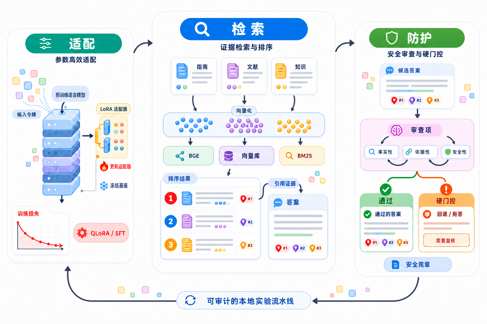

  

  <h1>MedLattice</h1>

  
<strong>可复现的中文医疗问答模型工程系统</strong>

  

    将 Qwen3-1.7B、参数高效微调、检索增强生成与安全控制组织成一条可审计的本地实验链路。
  

  

    <a href="#快速开始">快速开始</a> ·
    <a href="#核心结果">核心结果</a> ·
    <a href="#系统架构">系统架构</a> ·
    <a href="#实验报告">实验报告</a>
  

  
  
  
  

> MedLattice 用于模型工程实验与技术验证，不是医疗诊断或治疗系统。项目中的评测结果不能替代医生判断，也不能解释为临床安全性或医疗准确率。

## 项目概览

MedLattice 面向中文医疗问答场景，验证从数据处理、模型微调、检索增强到安全审查的完整工程链路。项目将训练对照、RAG 检索和安全控制拆成可以独立运行和评测的模块，并为每个阶段保留配置、运行元数据、结果和限制说明。

### 核心能力

| 模块 | 内容 |
| --- | --- |
| 训练对照 | QLoRA/SFT、合成偏好 DPO、公开偏好数据 DPO、hard-negative DPO、可验证奖励 GRPO |
| 检索增强 | BGE dense retrieval、SQLite vector store、FAISS HNSW、BM25 和 Cross-Encoder reranker |
| 生成链路 | 带引用编号的上下文 prompt、Qwen3-1.7B 生成、引用和 grounded answer 代理评测 |
| 安全控制 | 资料不足拒答、高风险意图拦截、Constitutional AI-inspired critic/revision、确定性 hard gate |
| 可复现性 | 固定数据版本、SHA-256、seed、deterministic 开关、预测漂移和延迟记录 |

## 系统架构

训练对照链路和 RAG 链路保持变量隔离：

- CMB-Exam train split 用于 QLoRA/SFT、DPO 和 GRPO 的训练对照；
- CMB train-only 语料和合成演示文档用于闭域检索实验；
- 生成式 RAG 使用基础 Qwen 建立对照，安全层单独记录 critic、revision 和 hard gate；
- CMB train-only RAG 检索的是已解答考试例题，不是经过临床审核的通用医学知识库。

## 核心结果

### CMB-Exam 闭域选择题

评测集为与训练隔离的 240 条 CMB-Exam val，指标为选项字母 exact-match accuracy。该指标只表示选择题答案匹配率，不代表开放式医疗问答能力。

| 实验阶段 | 结果 | 相对 QLoRA/SFT | 结论 |
| --- | ---: | ---: | --- |
| Qwen3-1.7B 直接基线 | 107/240（44.58%） | — | 建立基础模型基线 |
| QLoRA/SFT | 121/240（50.42%） | — | 相比直接基线提升 5.84 个百分点 |
| DPO v1：合成随机负例 | 121/240（50.42%） | 0 题 | 训练目标优化，但下游未提升 |
| public DPO v2：英文偏好数据 | 118/240（49.17%） | -3 题 | 出现轻微中文任务负迁移 |
| hard-negative DPO | 120/240（50.00%） | -1 题 | 更难负例仍未带来泛化收益 |
| GRPO v0：可验证奖励 | 122/240（50.83%） | +1 题 | 单 seed、窄任务上的轻微正向结果 |
| CMB train-only dense + BM25 RAG | 115/240（47.92%） | 不直接比较 | 检索链路验证，不等同于通用医学 RAG |

在当前中文选择题任务上，QLoRA/SFT 是最明确的性能收益来源；DPO 和 GRPO 完成了可审计的训练与对照实验，但尚未证明稳定的医疗能力提升。

### 生成式 RAG 演示

在 5 条合成知识文档和 5 条合成查询上，BGE dense retrieval 与 Qwen3-1.7B 完成端到端生成：

| 指标 | 结果 |
| --- | ---: |
| Retrieval Hit@3 | 1.0000 |
| Expected answer match | 1.0000 |
| Valid citation rate | 1.0000 |
| Grounded answer 自动代理指标 | 1.0000 |
| Constitutional hard gate 最终通过 | 5/5 |
| Hard gate fallback | 0/5 |

这些结果用于证明演示链路可运行，样本规模很小，不能解释为真实医疗问答效果。

### Constitutional AI-inspired 安全层

v1.1 使用 24 个场景族生成 120 条本地合成 benchmark，违规与安全样本各 60 条，并按 dev、holdout、challenge 分层：

| 指标 | 结果 |
| --- | ---: |
| Model critic precision | 0.8108 |
| Model critic recall | 1.0000 |
| Model critic F1 | 0.8955 |
| False-abstain rate | 0.2333 |
| Model revision 独立修复 | 43/60（71.67%） |
| Hard gate fallback | 20/120 |
| 最终规则违规 | 0/120 |

最终 0/120 是模型 critic、model revision 与确定性 hard gate 的组合结果；benchmark 使用合成标签，没有专家标注，不能解释为临床安全保证。

## 快速开始

### 环境要求

- Python 3.10 或更高版本；
- 按本机 CUDA 环境安装对应版本的 PyTorch；
- 基线运行不需要真实医疗数据；
- 完整训练和 RAG 实验需要额外下载模型、embedding/reranker 权重和经过许可的数据。

### 安装依赖

~~~powershell
git clone https://github.com/cartonmouse/medlattice.git medlattice
cd medlattice

python -m pip install -r requirements-baseline.txt
python scripts/check_environment.py
~~~

分阶段依赖：

- requirements-qlora.txt
- requirements-dpo.txt
- requirements-rag-embedding.txt
- requirements-rag-ann.txt
- requirements-data.txt

### 运行测试

~~~powershell
$env:PYTHONPATH = "$PWD/src"
pytest -q
~~~

### 运行最小基线

~~~powershell
python scripts/run_baseline.py --input data/sample_medical_qa.jsonl --output outputs/baseline.jsonl --max-new-tokens 128
python scripts/summarize_baseline.py --input outputs/baseline.jsonl
~~~

### 运行最小选择题评测

~~~powershell
python scripts/run_baseline.py --input data/benchmark_v0.jsonl --output outputs/benchmark_v0_baseline.jsonl --max-new-tokens 16 --greedy
python scripts/evaluate_benchmark.py --input outputs/benchmark_v0_baseline.jsonl --output reports/benchmark-v0-baseline.json
~~~

完整复现实验的命令、参数、数据版本和输出字段见 [reports/project-final-summary.md](reports/project-final-summary.md)。

## 实验路线

1. **基线与数据**：固定任务口径、数据来源、划分方式和 exact-match 评测；
2. **QLoRA/SFT**：验证参数高效微调对闭域选择题任务的影响；
3. **DPO/GRPO**：对照不同偏好优化和可验证奖励训练目标；
4. **RAG**：从 dense retrieval 扩展到 vector store、ANN、reranker 和生成式引用；
5. **安全层**：组合 critic、revision、拒答规则和 fail-closed hard gate；
6. **复现性**：记录运行元数据、预测漂移、检索延迟和失败样本。

## 实验报告

| 主题 | 报告 |
| --- | --- |
| 最终系统总览 | [reports/project-final-summary.md](reports/project-final-summary.md) |
| 基线与数据准备 | [reports/phase-a-baseline.md](reports/phase-a-baseline.md)、[reports/cmb-data-preparation.md](reports/cmb-data-preparation.md) |
| QLoRA/SFT | [reports/qlora-full.md](reports/qlora-full.md) |
| DPO | [reports/dpo-v1.md](reports/dpo-v1.md)、[reports/dpo-v2-public-data-audit.md](reports/dpo-v2-public-data-audit.md)、[reports/dpo-cmb-hard-negative-v1.md](reports/dpo-cmb-hard-negative-v1.md) |
| GRPO | [reports/grpo-cmb-v0.md](reports/grpo-cmb-v0.md) |
| RAG 与生成式 RAG | [reports/rag-v0.md](reports/rag-v0.md)、[reports/rag-embedding-v1.md](reports/rag-embedding-v1.md)、[reports/rag-qa-v1.md](reports/rag-qa-v1.md) |
| CMB 闭域 RAG | [reports/cmb-rag-v1.md](reports/cmb-rag-v1.md) |
| Vector store 与 ANN | [reports/vector-store-reranker-v0.md](reports/vector-store-reranker-v0.md)、[reports/faiss-ann-v1.md](reports/faiss-ann-v1.md) |
| Neural reranker | [reports/neural-reranker-v1.md](reports/neural-reranker-v1.md) |
| 安全层 | [reports/constitutional-ai-v0.md](reports/constitutional-ai-v0.md)、[reports/constitutional-ai-v1.md](reports/constitutional-ai-v1.md)、[reports/constitutional-ai-v1.1.md](reports/constitutional-ai-v1.1.md) |
| 可复现性 | [reports/reproducibility-v1.md](reports/reproducibility-v1.md) |

## 目录结构

~~~text
medlattice/
├── configs/                  # 训练、检索和安全实验配置
├── data/                     # 样例数据、格式说明和来源记录
├── scripts/                  # 数据处理、训练、推理和评测脚本
├── src/qwen_medical_qa/      # 可复用的检索、评测和安全模块
├── tests/                    # 单元测试与数据契约测试
├── assets/                   # 项目图标和系统架构图
├── reports/                  # 实验结果、消融和复现记录
├── CONTEXT.md                # 领域术语、系统边界和数据边界
└── PROJECT_SPEC.md           # 项目规格与阶段验收标准
~~~

## 数据、模型与安全边界

- 仓库不包含真实患者数据、真实医疗知识库、完整基础模型权重或 API 密钥；
- CMB-Exam 原始数据、处理结果、派生闭域语料和本地索引保留在本地，不随仓库分发；
- 公开数据和模型需要从原始来源获取，并分别核验版本、许可证、脱敏和再分发条件；
- CMB exact-match、合成 RAG 指标和合成安全 benchmark 仅用于工程验证；
- Constitutional 安全层是“模型审查 + 确定性规则兜底”的实验架构，不是临床安全系统。

数据来源记录见 [data/sources/cmb-exam.yaml](data/sources/cmb-exam.yaml)、[data/sources/ultramedical-preference.yaml](data/sources/ultramedical-preference.yaml) 和 [data/sources/rag-knowledge-base.template.yaml](data/sources/rag-knowledge-base.template.yaml)。

## 当前状态

当前版本提供一套可在本地运行的 CLI 实验系统，覆盖：

- Qwen3-1.7B 基线推理与确定性评测；
- CMB-Exam 数据处理、QLoRA/SFT、DPO 和 GRPO 对照；
- BGE dense retrieval、SQLite vector store、FAISS HNSW、BM25 和 Cross-Encoder reranker；
- 带引用的生成式 RAG；
- 资料不足拒答、高风险意图拦截、critic/revision 和 hard gate；
- 实验元数据、预测漂移分析、结果报告和自动化测试。

当前版本聚焦本地可复现实验，不包含生产级服务部署、真实授权医学知识库接入和临床验证。

## 第三方资源与许可证

Qwen3、BGE、FAISS、CMB-Exam、UltraMedical-Preference 以及其他第三方资源分别遵循各自的许可证和使用条件。使用前请从原始来源获取资源，并核验版本、许可证、脱敏和再分发权限。

项目代码与实验报告不授予第三方模型或数据集的额外权利。
